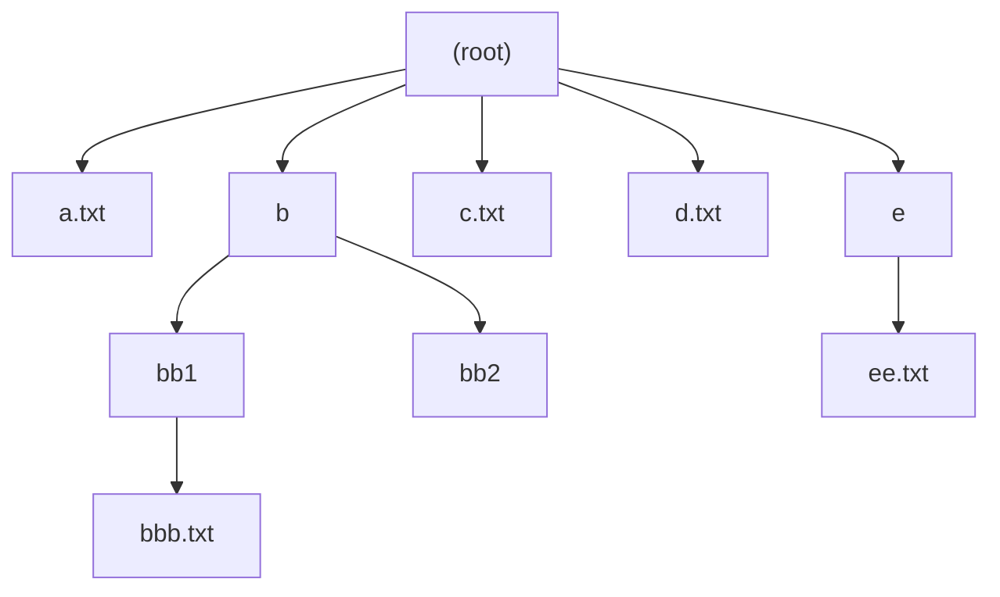
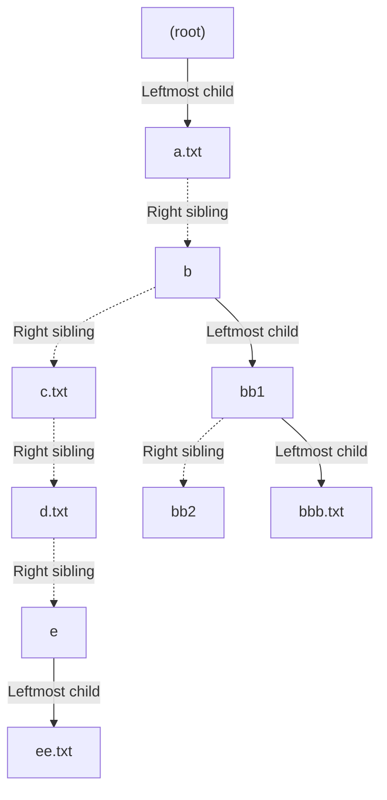

# C++ File System 
> In progress

<table> <tr> <td>

</td> <td>
  

</td> </tr> </table>

## Supports:
- cd
- ls
- tree
- pwd
- touch
- mkdir
- rm
- rmdir
- mv

## How to run
In your terminal, cd into the root directory **CPP-File-System**.
Then in your terminal, compile the project by running the makefile:  
> make

If the project compiles successfully, an executable **main** will appear in the directory, run it by typing:
> ./main

Initially, the project will have no data. To load data into the emulator, type:
> load 1

This is typed ***inside the main executable***.  
There are three file groups available to load: load 1, load 2, and load 3.

